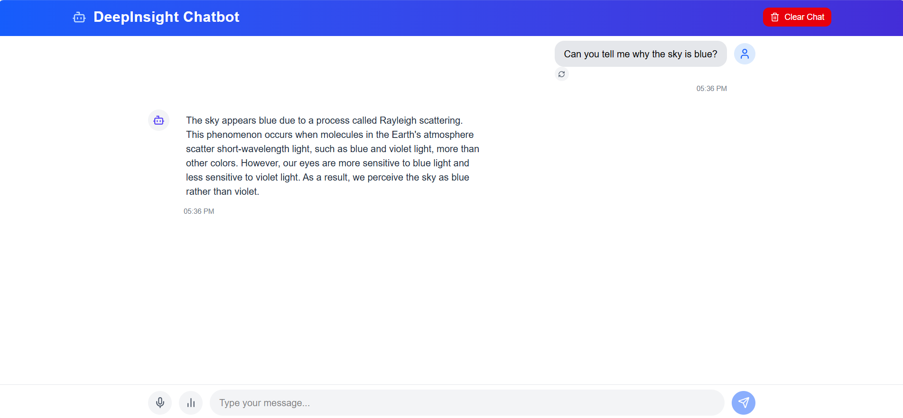
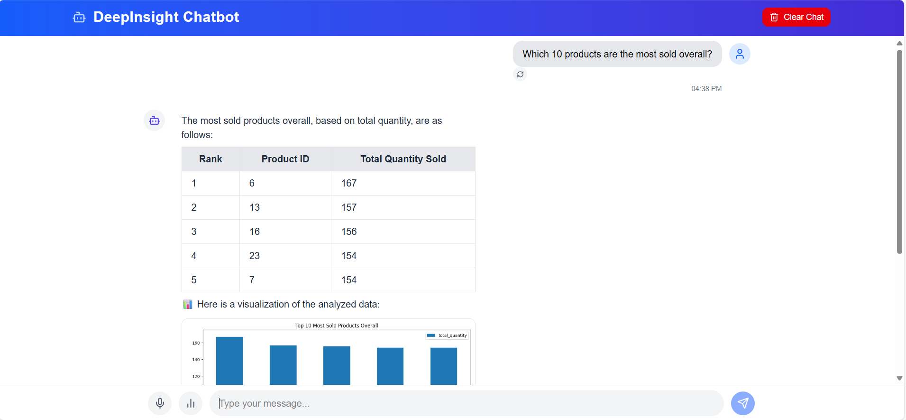
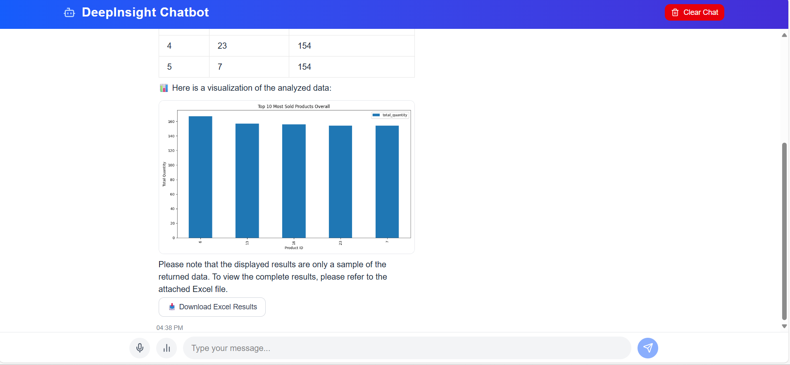
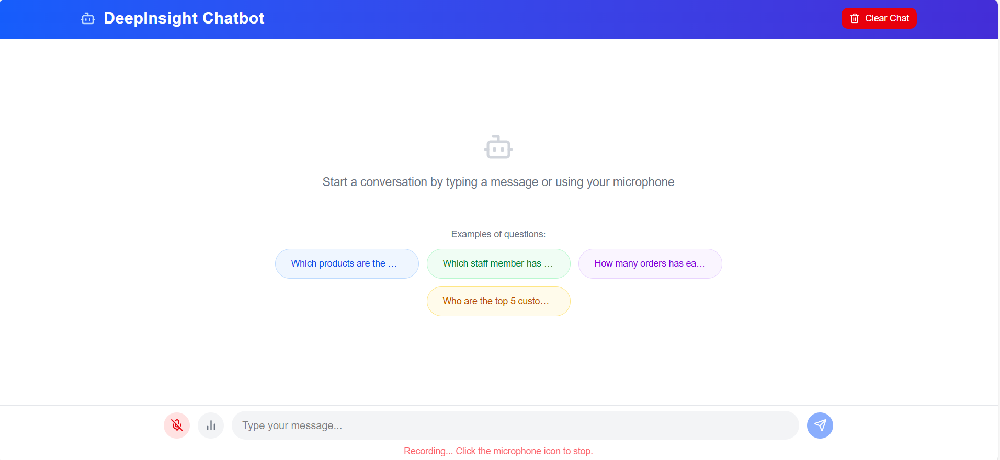
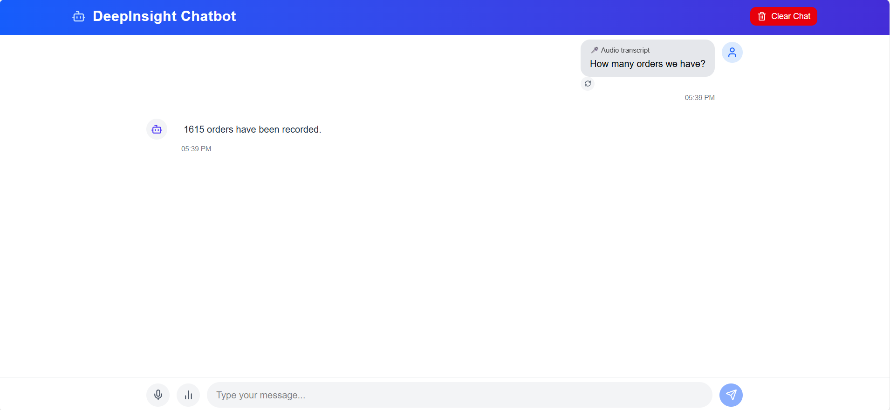
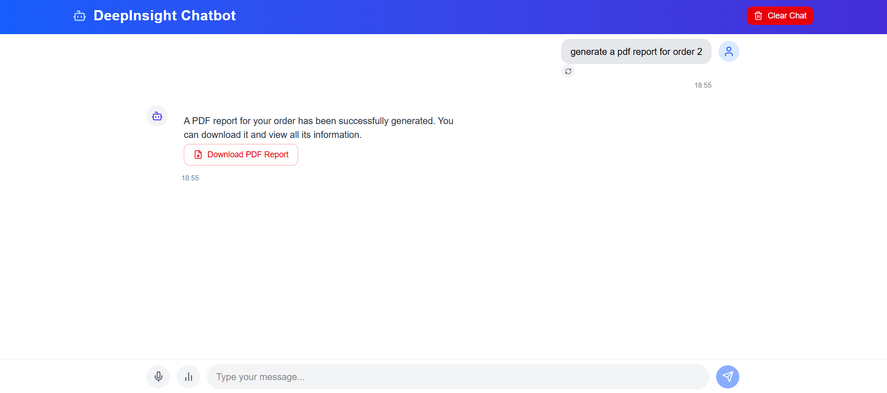
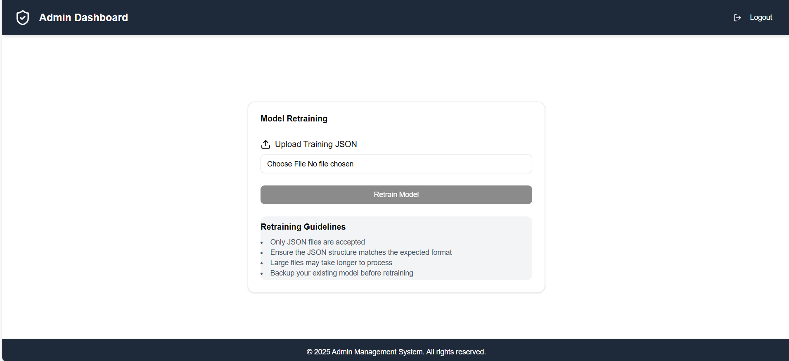

# 🧠 AI SQL Chatbot

An intelligent Voice&Text chatbot built with FastAPI and React, converts natural language questions into SQL queries using OpenAI's GPT models. It executes queries on your database, returns structured results, and supports chart and PDF generation.

## 🌟 Core Functionalities

### 1. 🧾 Smart Question Answering
> Get instant answers to general knowledge or business-specific questions using LLMs.

---

### 2. 🗄️ Database Query Assistant
> Convert natural language to SQL, execute it on your DB, and/or receive structured responses or downloadable results.

---

### 3. 🎙️ Voice-to-Text Transcription
> Transcribe voice recordings into text using OpenAI's Whisper for hands-free chatbot interaction.

---

### 4. 📄 PDF Report Generator
> Generate styled PDF reports for orders or custom data using Jinja2 templates and xhtml2pdf.

---

### 5. 🔁 Custom Model Retraining
> Upload example question-answer pairs to improve the chatbot's SQL understanding on your specific schema.

## 🛠️ Tech Stack

- **FastAPI** & **Pydantic**
- **OpenAI** + **LangChain**
- **Whisper** (Speech-to-text)
- **pandas**, **matplotlib**, **xhtml2pdf**
- **Jinja2** (for PDF templating)
- **React** (for frontend developement)

---

## 🚀 Features

- 🎯 Natural language → SQL query conversion
- 📊 Chart generation based on query results (bar, line, pie, scatter)
- 📄 PDF report generation for specific queries
- 📥 Export SQL results to Excel
- 🗣️ Whisper-based voice transcription
- 🔁 Retrain chatbot with custom examples
- 🔌 Built-in streaming response support (OpenAI API)
  
---
## 🗄️ Targeted Database

This AI chatbot is currently configured to work with the **`bikesdb`** dataset — a sample **Microsoft SQL Server (MSSQL)** database used for business analytics and reporting.

You can explore and download the `bikesdb` from this link:  
👉 [Download bikesdb MSSQL Sample DB](https://www.sqlservertutorial.net/getting-started/load-sample-database)

> 💡 **Want to use your own MSSQL database?**  
Simply replace the `ddls.json` and `examples.json` files located in the `Data/` folder with your own schema and question-answer examples. This will allow the chatbot to understand and interact with your specific database structure.
---

## Contributing
Contributions are welcome! Please open an issue or submit a pull request with any improvements or bug fixes.

## License
This project is licensed under the MIT License - see the [LICENSE](LICENSE) file for details.

